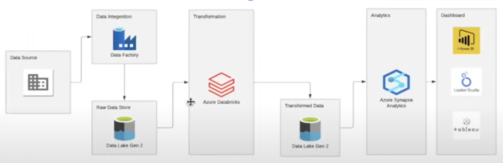

# tokyo-olympics
## introduction 
This project uses Azure services to build a data pipeline for analyzing Tokyo Olympics data. It integrates Azure Storage, Azure Databricks, and Azure Synapse Analytics to efficiently manage, process, and analyze Olympic datasets.

## Architecture 

## Technology Used 
1. programming language -python
2. scripting language -SQL
3. Microsoft Azure :https://portal.azure.com/
   - Azure Storage Account
   - Azure Databricks
   - Azure Synapse Analytics

## Dataset used 
This project utilizes the Tokyo Olympics dataset from [hania222/tokyo-olympics](https://github.com/hania222/tokyo-olympics/tree/main). The dataset encompasses detailed information on teams, athletes, medal counts, entries by gender, and coaches, offering a comprehensive view of the performances and dynamics of the 2021 Olympic Games.

original Dataset: https://www.kaggle.com/datasets/arjunprasadsarkhel/2021-olympics-in-tokyo 

## Scripts for the project
1.[Extract and Load](Images/pipline.PNG.png)
2.[Transform](https://github.com/hania222/tokyo-olympics/blob/main/Notebook%202024-09-08%2015_39_12.ipynb)
 

